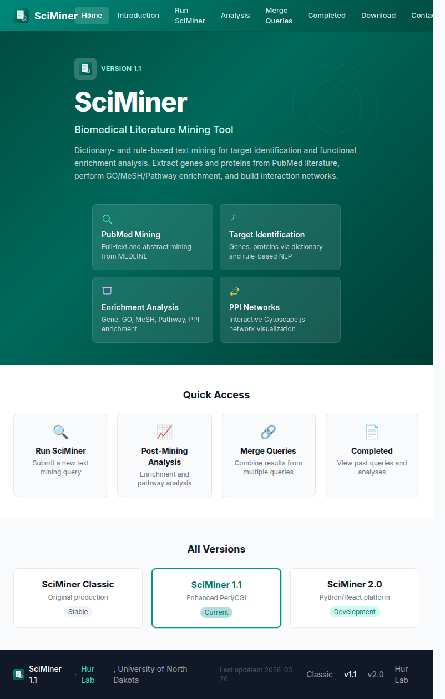
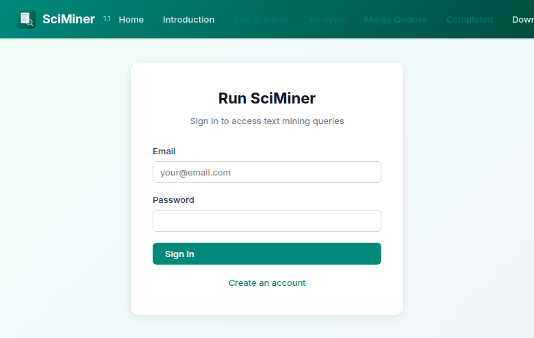

# SciMiner Legacy (v1.1)

Enhanced Perl/CGI biomedical literature mining tool with modernized web interface.



## Overview

SciMiner 1.1 is the enhanced version of the original [SciMiner](https://hurlab.med.und.edu/SciMiner/) text mining tool. It provides dictionary- and rule-based biomedical literature mining for target identification and functional enrichment analysis from PubMed literature.

**Live:** [https://hurlab.med.und.edu/SciMiner1.1/](https://hurlab.med.und.edu/SciMiner1.1/)

### What's New in v1.1 (vs Classic)

- **Security:** Bcrypt password hashing (with legacy fallback for migration)
- **Deployment:** Tomcat CGI servlet (vs Apache httpd)
- **Configuration:** Centralized `Config.pm` with environment variables
- **Logging:** Structured `Logger.pm` (DEBUG/INFO/WARN/ERROR)
- **UI:** Modernized responsive interface with topbar navigation
- **Testing:** 8-test Perl test suite

### Features

- PubMed full-text and abstract mining
- Gene/protein target identification via dictionary and rule-based NLP
- Functional enrichment analysis:
  - Gene enrichment (Fisher's exact test)
  - Gene Ontology (GO) enrichment
  - MeSH term enrichment
  - Pathway enrichment (KEGG, Reactome)
  - Protein-Protein Interaction (PPI) network analysis
- Query comparison and merging
- Interactive network visualization (Cytoscape.js)
- EndNote citation export



## Tech Stack

| Component | Technology |
|-----------|-----------|
| Backend | Perl 5.38, CGI::Application |
| Database | MySQL 8.0 (shared with Classic) |
| Templates | HTML::Template |
| Auth | Bcrypt (Crypt::Eksblowfish::Bcrypt) |
| Network Viz | Cytoscape.js 3.30 |
| Web Server | Apache Tomcat 9.0 (CGI servlet) + Nginx |
| Frontend | HTML5, CSS3 (custom sciminer-modern.css) |

## Directory Structure

```
SciMiner1.1/
├── index.html                    # Landing page
├── css/sciminer-modern.css       # Modern stylesheet
├── favicon.svg                   # Shared favicon
├── WEB-INF/
│   ├── web.xml                   # Tomcat CGI servlet config
│   └── cgi/                      # CGI scripts and templates
│       ├── *Launch.cgi           # Entry points (login + content)
│       ├── *.cgi                 # Processing scripts
│       ├── *Index.tmpl           # Login/wrapper templates
│       ├── *.tmpl                # Content templates
│       ├── shared_header.tmpl    # Topbar navigation
│       ├── shared_footer.tmpl    # Footer with version links
│       ├── SciMinerUI.pm         # Perl module for topbar/footer
│       ├── MinimalApp*.pm        # CGI::Application modules
│       └── sciminer.js           # Client-side JavaScript
├── SciMiner/                     # Public static files
│   ├── Images/                   # UI icons and logos
│   ├── Files/                    # User manual, supplementary files
│   ├── Samples/                  # Sample query results
│   ├── intro2.html               # Introduction page
│   ├── contact2.html             # Contact page
│   └── download.html             # Download page
├── annotation/SciMinerDB/        # Backend data and config
│   ├── annotationENV.ini         # Configuration (not in repo)
│   ├── Modules/Annotation/       # Core Perl modules
│   │   ├── SciMiner.pm           # Main mining engine (~32K lines)
│   │   ├── Config.pm             # Configuration management
│   │   ├── SciMinerSecurity.pm   # Bcrypt authentication
│   │   └── Logger.pm             # Structured logging
│   └── Scripts/                  # Utility scripts
├── scripts/                      # Setup and migration scripts
└── t/                            # Perl test suite
```

## Setup

### Prerequisites

- Perl 5.38+
- MySQL 8.0+
- Apache Tomcat 9.0+ (with CGI servlet enabled)
- Nginx (reverse proxy)

### Required Perl Modules

```bash
cpan install CGI CGI::Application CGI::Session HTML::Template
cpan install DBI DBD::mysql
cpan install LWP::UserAgent JSON XML::LibXML
cpan install Crypt::Eksblowfish::Bcrypt
cpan install Spreadsheet::WriteExcel Boulder::Medline Text::NSP
```

### Configuration

```bash
# Copy template and configure
cp annotation/SciMinerDB/annotationENV.template.ini annotation/SciMinerDB/annotationENV.ini
chmod 600 annotation/SciMinerDB/annotationENV.ini
# Edit with your database credentials and paths
```

### Tomcat Configuration

The `WEB-INF/web.xml` configures the CGI servlet. Ensure Tomcat has:
- `privileged="true"` in the Context configuration
- Perl installed at `/usr/bin/perl`

## Database

SciMiner 1.1 shares the `sciminer` MySQL database with Classic. Key tables:
- `user` — User accounts (with `password_hash` for bcrypt)
- `query` — Mining queries and results
- `analysis` — Enrichment analysis results

Adding columns (like `password_hash`) does not affect Classic's functionality.

## Other Versions

| Version | Description | URL |
|---------|-------------|-----|
| Classic | Original Perl/CGI (stable) | [/SciMiner/](https://hurlab.med.und.edu/SciMiner/) |
| **v1.1** | Enhanced Perl/CGI with modern UI | [/SciMiner1.1/](https://hurlab.med.und.edu/SciMiner1.1/) |
| v2.0 | Python/React platform (development) | [/SciMiner2.0/](https://hurlab.med.und.edu/SciMiner2.0/) |

## Citation

> Hur J, Schuyler AD, States DJ, Feldman EL: SciMiner: web-based literature mining tool for target identification and functional enrichment analysis. *Bioinformatics* 2009, 25(6):838-840.

## License

Developed by [Hur Lab](https://hurlab.med.und.edu/), University of North Dakota School of Medicine & Health Sciences.
